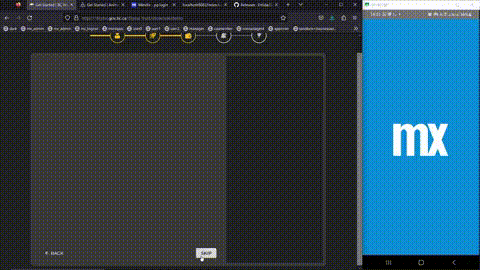
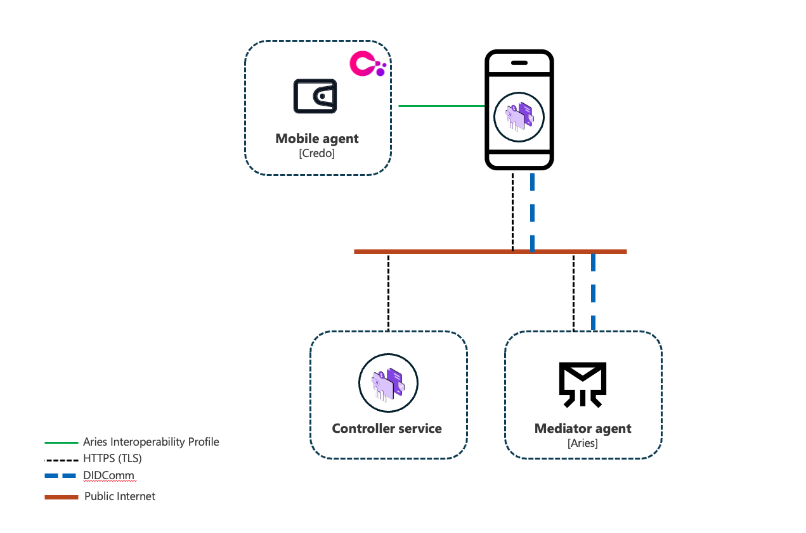
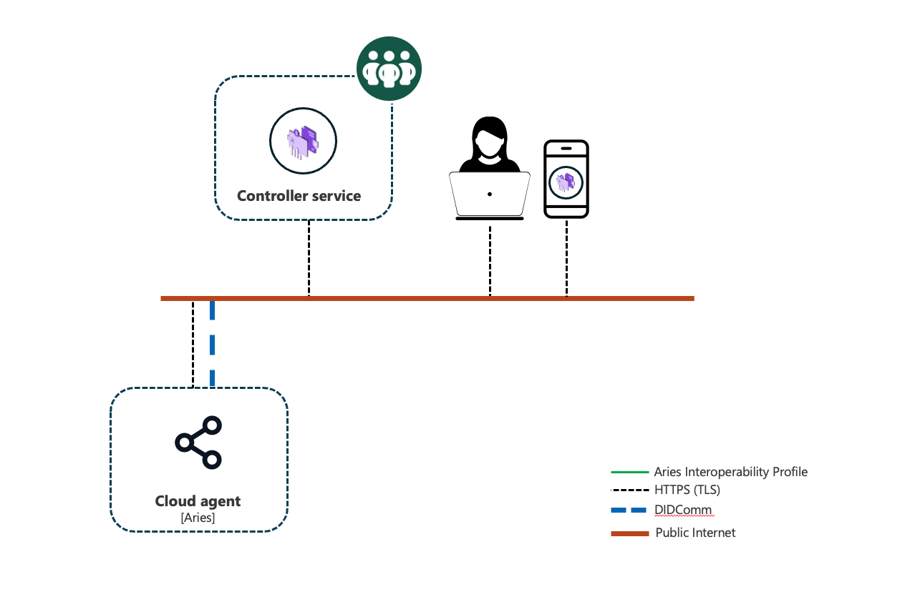

# Farmworker Wallet OS

The Farmworker Wallet OS is a solution framework built to jumpstart the integration of digital trust technologies with the [Mendix](https://www.mendix.com/) low-code application platform. The framework 
makes it easy for any Mendix app to interoperate with open-standard technologies like [decentralized identifiers](https://www.w3.org/TR/did-core/), [DIDComm](https://didcomm.org), and [verifiable credentials](https://www.w3.org/TR/vc-data-model/).



## Wallet SDK Components

Farmworker Wallet OS is more than a single application. The project has grown into a suite of
reusable components that together function as a **digital wallet SDK for Mendix** — a set of
solution modules, pluggable widgets, and reference implementations that can be embedded into any
Mendix application to add decentralized identity and secure messaging capabilities to the user
experience.

Components are consumed independently. Import only what your use case requires — see
[Embedding the SDK in your own Mendix app](#embedding-the-sdk-in-your-own-mendix-app).

### Architecture

The suite supports two deployment models, and most components belong to one or the other. A
**native agent** runs the wallet on the user's smartphone device, holding keys and credentials locally. A
**cloud agent** runs the wallet server-side (Controller agent) on behalf of the user. Both are addressed through
Mendix modules, and an app can combine them.

| Native agent | Cloud agent |
| --- | --- |
|  |  |

### Solution Modules — Native Agent

Mendix modules exposing on-device wallet capability as domain models, microflows, nanoflows, and
JavaScript actions. These wrap [Credo-ts](https://github.com/openwallet-foundation/credo-ts) and
require a custom React Native build.

| Module | Purpose | Repository | Marketplace |
| --- | --- | --- | --- |
| **Agent_SDK** | Wrapper implementation to [Credo-ts](https://github.com/openwallet-foundation/credo-ts) | _TBD_ | — |
| **DIDComm_BLE** | Wrapper implementation to [React Native Bluetooth Low Energy SDK for DIDComm](https://github.com/animo/react-native-ble-didcomm) | _TBD_ | — |
| **DIDComm_MediaSharing** | Wrapper implementation to [Credo's DIDComm Media Sharing protocol capability](https://didcomm.org/media-sharing/1.0/) | _TBD_ | — |
| **DIDComm_Receipts** | Wrapper implementation to [Credo's DIDComm Receipts protocol capability](https://didcomm.org/receipts/1.0/) | _TBD_ | — |
| **DIDComm_RPC** | Wrapper implementation to [Credo's DIDComm RPC protocol capability](https://github.com/decentralized-identity/aries-rfcs/tree/main/features/0804-didcomm-rpc) | _TBD_ | — |
| **DIDComm_Survey** | Wrapper implementation to [Credo's DIDComm Survey protocol capability](https://github.com/Entidad/credo-ts-survey) | _TBD_ | — |
| **DIDComm_UserProfile** | Wrapper implementation to [Credo's DIDComm User Profile protocol capability](https://didcomm.org/user-profile/1.0/) | _TBD_ | — |
| **KeyManagement** | Manage private keys on web and mobile (iOS and Android) platforms | [farmworker-wallet-os-kms](https://github.com/openwallet-foundation-labs/farmworker-wallet-os-kms) | [Listing](https://marketplace.mendix.com/link/component/302039) |

### Solution Modules — Cloud Agent

Mendix modules for running the wallet server-side. No native build is required — these work in any
Mendix app, including responsive web.

| Module | Purpose | Repository | Marketplace |
| --- | --- | --- | --- |
| **Digital ID SDK** | Enables the infrastructure elements for a Cloud Wallet in Mendix, bringing in components for Controllers, Connections, Credentials, and Verifications | [fwos-cloudagent-core](https://github.com/Entidad/fwos-cloudagent-core) | [Listing](https://marketplace.mendix.com/link/component/227014) |
| **DIDComm SDK** | Adds support for specific DIDComm protocols | [fwos-cloudagent-didcomm](https://github.com/Entidad/fwos-cloudagent-didcomm) | [Listing](https://marketplace.mendix.com/link/component/226667) |
| **AnonCreds VC SDK** | Brings in support for Schemas and CredentialDefinitions according to the AnonCreds specifications | [fwos-cloudagent-core](https://github.com/Entidad/fwos-cloudagent-core) | [Listing](https://marketplace.mendix.com/link/component/227012) |

### Solution Modules — Connectors

Mendix modules that integrate the wallet with external services.

| Module | Purpose | Repository | Marketplace |
| --- | --- | --- | --- |
| **AWS KMS Connector Module for Mendix** | Manage AWS KMS encryption and digital signature keys | [mendix-aws-kms-connector](https://github.com/Entidad/mendix-aws-kms-connector) | [Listing](https://marketplace.mendix.com/link/component/258864) |
| **Twilio Access Token Generator v3** | Generate access tokens required to authenticate Mendix application users to Twilio communications services | [farmworker-wallet-os-video](https://github.com/Entidad/farmworker-wallet-os-video) | [Listing](https://marketplace.mendix.com/link/component/242851) |
| **Twilio Video** | Adds high-quality video (WebRTC) capability to your Mendix application, powered by the Twilio Video programmable API. Includes a working demo. | [farmworker-wallet-os-video](https://github.com/Entidad/farmworker-wallet-os-video) | [Listing](https://marketplace.mendix.com/link/component/242852) |
| **Paradym Connector** | Integrate with the Paradym API for issuing, verifying, and other identity actions in Mendix | [connector_paradym](https://github.com/Entidad/connector_paradym) | [Listing](https://marketplace.mendix.com/link/component/226659) |

### Pluggable Widgets — React Native

Widgets for native mobile pages. Import the `.mpk` into your app's `widgets/` folder, or install
from the Marketplace, and the widget appears in the Studio Pro Toolbox.

| Widget | Purpose | Repository | Marketplace |
| --- | --- | --- | --- |
| **Native Icon Text Box** | Native text box with mappable leading and trailing icons | [mendix-react-native-icontextbox](https://github.com/Entidad/mendix-react-native-icontextbox) | [Listing](https://marketplace.mendix.com/link/component/303675) |
| **Native URL Image** | Displays an image from a URL held in a String attribute, at a fixed width and height | [mendix-react-native-url-imageviewer](https://github.com/Entidad/mendix-react-native-url-imageviewer) | [Listing](https://marketplace.mendix.com/link/component/303677) |
| **Native QR Code** | Renders a QR code from a String attribute on a native page | [mendix-react-native-qrcode](https://github.com/Entidad/mendix-react-native-qrcode) | [Listing](https://marketplace.mendix.com/link/component/303683) |
| **Native Pin Input** | Native mobile PIN input | [mendix-react-native-pininput](https://github.com/Entidad/mendix-react-native-pininput) | — |
| **Native Link Extractor** | Renders links from plain text | [mendix-react-native-linkextractor](https://github.com/Entidad/mendix-react-native-linkextractor) | [Listing](https://marketplace.mendix.com/link/component/303681) |
| **Native Scrollview** | Custom React Native `ScrollView`, serving as a base for implementing custom scroll behavior | [mendix-react-native-scrollview](https://github.com/Entidad/mendix-react-native-scrollview) | — |
| **Native Image** | Native image viewer | [mendix-react-native-imageviewer](https://github.com/Entidad/mendix-react-native-imageviewer) | — |
| **Native Verification Code** | A segmented code entry field for native pages | [mendix-react-native-verification-code](https://github.com/Entidad/mendix-react-native-verification-code) | [Listing](https://marketplace.mendix.com/link/component/303684) |
| **MapLibre Native MarkerView** | Renders MapLibre Native map and marker views on OpenStreetMap-style vector maps inside your native app | [mendix-react-native-maplibre](https://github.com/Entidad/mendix-react-native-maplibre) | [Listing](https://marketplace.mendix.com/link/component/257222) |
| **Native Twilio Video WebRTC** | Mendix implementation of `@twilio/video-react-native-sdk` | [mendix-react-native-twilio-video-webrtc](https://github.com/Entidad/mendix-react-native-twilio-video-webrtc) | — |
| **Native OnChange** | Execute nanoflows on widget mount, data change, and widget unmount | [mendix-react-native-onchange](https://github.com/Entidad/mendix-react-native-onchange) | — |

### React Native Packages

Native npm modules consumed by the widgets and native template. These are not Mendix widgets and do
not appear in the Toolbox — install them as dependencies of your React Native build.

| Package | Purpose | Repository | Marketplace |
| --- | --- | --- | --- |
| **react-native-isemulator** | Tests whether an iOS or Android application is running under emulation or on a real device | [react-native-isemulator](https://github.com/Entidad/react-native-isemulator) | — |

### Pluggable Widgets — Web

Widgets for responsive web and tablet pages, built with React.

| Widget | Purpose | Repository | Marketplace |
| --- | --- | --- | --- |
| **Twilio Video WebRTC (Web)** | Join video calls from a browser | [mendix-web-twilio-video-webrtc](https://github.com/Entidad/mendix-web-twilio-video-webrtc) | — |
| **Verification Code (Web)** | A segmented code entry field for web pages | [mendix-react-web-verification-code](https://github.com/Entidad/mendix-react-web-verification-code) | — |
| **Easy Image** | Image manipulation — zoom in/out, pan, rotate clockwise/counterclockwise, crop, and download | [react-easy-image](https://github.com/Entidad/react-easy-image) | [Listing](https://marketplace.mendix.com/link/component/221044) |

### Demo Solutions

Reference implementations showing the components working together. Use these to evaluate the SDK or
as a starting point, rather than importing them into a production app.

| Solution | Demonstrates | Repository | Marketplace |
| --- | --- | --- | --- |
| **Agent_TestHarness** | Core wallet functionality such as creating peer-to-peer DID connections, secure messaging over DID connections, verifiable credential exchange, and DIDComm protocols. Ships as a Mendix module — import it alongside **Agent_SDK** to exercise the native agent. | _TBD_ | — |
| **fwos-demo-app** | End-to-end reference wallet combining the modules and widgets above — peer-to-peer DID connections, secure DIDComm messaging, and verifiable credential exchange. Included in this repository as `fwos-demo-app.mpr`; see [Quick Start](#quick-start). | [farmworker-wallet-os](https://github.com/openwallet-foundation-labs/farmworker-wallet-os) | — |

## Embedding the SDK in your own Mendix app

The components above are designed to be consumed independently. You do not need to fork this
repository or adopt the demo app to add wallet capabilities to an existing Mendix application —
import only the modules and widgets your use case requires.

### 1. Install from the Mendix Marketplace (recommended)

Most components are published as packaged resources on the [Mendix Marketplace](https://marketplace.mendix.com).
This is the normal path for Mendix developers and keeps your app on released, version-tagged builds.

* In Studio Pro, open the **Marketplace** pane (`View` > `Marketplace`) or browse
  [marketplace.mendix.com](https://marketplace.mendix.com) in a browser.
* Search for the component by name, or follow the **Marketplace** link in the component tables above.
* Click **Download** and select your app. Studio Pro will import the module (`.mpk`) or pluggable
  widget into your project.
* Solution modules land under **App Explorer** > *module name*; pluggable widgets appear in the
  **Toolbox** and are ready to drop onto a page.

### 2. Install from GitHub (source, pre-release, or contribution)

Use the GitHub route when you need the source, want a build that has not yet been published to the
Marketplace, or intend to contribute changes back.

* Open the component's repository from the **Repository** link in the tables above.
* Download the packaged release artifact (`.mpk`) from the repository's **Releases** page, or build
  it from source per that repository's README.
* In Studio Pro, use `App` > `Import module package...` for solution modules, or copy the widget
  `.mpk` into your app's `widgets/` folder and press `F4` (Synchronize App Directory).

### 3. Resolve module dependencies

Some modules depend on others and will not compile on their own:

* **Agent_SDK** requires the **Encryption** module.

Import dependencies before the module that needs them.

### 4. Resolve JavaScript dependencies

**Agent_SDK**, **KeyManagement**, and **DIDComm_Survey** ship a `javascriptsource` package whose npm
dependencies are not committed to source control. After importing, install them from each module's
folder under `javascriptsource/` in your app:

```bash
npm install --legacy-peer-deps
```

Agent_SDK additionally requires `npx patch-package` to be run after install.

This repository's [`install.sh`](install.sh) performs these steps for the demo app and is a useful
reference for scripting the equivalent in your own build. Re-run after any upgrade of those modules,
and before the first local run.

### 5. Native mobile apps

Wallet components that use native device capabilities require a custom React Native build — the
Mendix "Make it Native" test app does not include their native dependencies.

* Build a custom React Native app from the Native Template in `./resources/nativeTemplate`
  (see [Run Native app](#run-native-app) below for the build configuration).
* Align your app's native dependencies with the template before building for iOS or Android.

### Compatibility

| Requirement | Version |
| --- | --- |
| Mendix Studio Pro | 11.12.3 |
| Node.js | v24 |
| Android Studio | Android Studio Quail 3 - 2026.1.3 |
| Xcode | 26.3 |


## Wallet SDK Components

Farmworker Wallet OS is more than a single application. The project has grown into a suite of
reusable components that together function as a **digital wallet SDK for Mendix** — a set of
solution modules, pluggable widgets, and reference implementations that can be embedded into any
Mendix application to add decentralized identity and secure messaging capabilities to the user
experience.

Components are consumed independently. Import only what your use case requires — see
[Embedding the SDK in your own Mendix app](#embedding-the-sdk-in-your-own-mendix-app).

### Architecture

The suite supports two deployment models, and most components belong to one or the other. A
**native agent** runs the wallet on the user's smartphone device, holding keys and credentials locally. A
**cloud agent** runs the wallet server-side (Controller agent) on behalf of the user. Both are addressed through
Mendix modules, and an app can combine them.

| Native agent | Cloud agent |
| --- | --- |
|  |  |

### Solution Modules — Native Agent

Mendix modules exposing on-device wallet capability as domain models, microflows, nanoflows, and
JavaScript actions. These wrap [Credo-ts](https://github.com/openwallet-foundation/credo-ts) and
require a custom React Native build.

| Module | Purpose | Repository | Marketplace |
| --- | --- | --- | --- |
| **Agent_SDK** | Wrapper implementation to [Credo-ts](https://github.com/openwallet-foundation/credo-ts) | [farmworker-wallet-os](https://github.com/openwallet-foundation-labs/farmworker-wallet-os)| — |
| **DIDComm_BLE** | Wrapper implementation to [React Native Bluetooth Low Energy SDK for DIDComm](https://github.com/animo/react-native-ble-didcomm) | [farmworker-wallet-os](https://github.com/openwallet-foundation-labs/farmworker-wallet-os) | — |
| **DIDComm_MediaSharing** | Wrapper implementation to [Credo's DIDComm Media Sharing protocol capability](https://didcomm.org/media-sharing/1.0/) | [farmworker-wallet-os](https://github.com/openwallet-foundation-labs/farmworker-wallet-os) | — |
| **DIDComm_Receipts** | Wrapper implementation to [Credo's DIDComm Receipts protocol capability](https://didcomm.org/receipts/1.0/) | [farmworker-wallet-os](https://github.com/openwallet-foundation-labs/farmworker-wallet-os) | — |
| **DIDComm_RPC** | Wrapper implementation to [Credo's DIDComm RPC protocol capability](https://github.com/decentralized-identity/aries-rfcs/tree/main/features/0804-didcomm-rpc) |[farmworker-wallet-os](https://github.com/openwallet-foundation-labs/farmworker-wallet-os) | — |
| **DIDComm_Survey** | Wrapper implementation to [Credo's DIDComm Survey protocol capability](https://github.com/Entidad/credo-ts-survey) | [farmworker-wallet-os](https://github.com/openwallet-foundation-labs/farmworker-wallet-os) | — |
| **DIDComm_UserProfile** | Wrapper implementation to [Credo's DIDComm User Profile protocol capability](https://didcomm.org/user-profile/1.0/) | [farmworker-wallet-os](https://github.com/openwallet-foundation-labs/farmworker-wallet-os)| — |
| **KeyManagement** | Manage private keys on web and mobile (iOS and Android) platforms | [farmworker-wallet-os-kms](https://github.com/openwallet-foundation-labs/farmworker-wallet-os-kms) | [Listing](https://marketplace.mendix.com/link/component/302039) |

### Solution Modules — Cloud Agent

Mendix modules for running the wallet server-side. No native build is required — these work in any
Mendix app, including responsive web.

| Module | Purpose | Repository | Marketplace |
| --- | --- | --- | --- |
| **Digital ID SDK** | Enables the infrastructure elements for a Cloud Wallet in Mendix, bringing in components for Controllers, Connections, Credentials, and Verifications | [fwos-cloudagent-core](https://github.com/Entidad/fwos-cloudagent-core) | [Listing](https://marketplace.mendix.com/link/component/227014) |
| **DIDComm SDK** | Adds support for specific DIDComm protocols | [fwos-cloudagent-didcomm](https://github.com/Entidad/fwos-cloudagent-didcomm) | [Listing](https://marketplace.mendix.com/link/component/226667) |
| **AnonCreds VC SDK** | Brings in support for Schemas and CredentialDefinitions according to the AnonCreds specifications | [fwos-cloudagent-core](https://github.com/Entidad/fwos-cloudagent-core) | [Listing](https://marketplace.mendix.com/link/component/227012) |

### Solution Modules — Connectors

Mendix modules that integrate the wallet with external services.

| Module | Purpose | Repository | Marketplace |
| --- | --- | --- | --- |
| **AWS KMS Connector Module for Mendix** | Manage AWS KMS encryption and digital signature keys | [mendix-aws-kms-connector](https://github.com/Entidad/mendix-aws-kms-connector) | [Listing](https://marketplace.mendix.com/link/component/258864) |
| **Twilio Access Token Generator v3** | Generate access tokens required to authenticate Mendix application users to Twilio communications services | [farmworker-wallet-os-video](https://github.com/Entidad/farmworker-wallet-os-video) | [Listing](https://marketplace.mendix.com/link/component/242851) |
| **Twilio Video** | Adds high-quality video (WebRTC) capability to your Mendix application, powered by the Twilio Video programmable API. Includes a working demo. | [farmworker-wallet-os-video](https://github.com/Entidad/farmworker-wallet-os-video) | [Listing](https://marketplace.mendix.com/link/component/242852) |
| **Paradym Connector** | Integrate with the Paradym API for issuing, verifying, and other identity actions in Mendix | [connector_paradym](https://github.com/Entidad/connector_paradym) | [Listing](https://marketplace.mendix.com/link/component/226659) |

### Pluggable Widgets — React Native

Widgets for native mobile pages. Import the `.mpk` into your app's `widgets/` folder, or install
from the Marketplace, and the widget appears in the Studio Pro Toolbox.

| Widget | Purpose | Repository | Marketplace |
| --- | --- | --- | --- |
| **Native Icon Text Box** | Native text box with mappable leading and trailing icons | [mendix-react-native-icontextbox](https://github.com/Entidad/mendix-react-native-icontextbox) | [Listing](https://marketplace.mendix.com/link/component/303675) |
| **Native URL Image** | Displays an image from a URL held in a String attribute, at a fixed width and height | [mendix-react-native-url-imageviewer](https://github.com/Entidad/mendix-react-native-url-imageviewer) | [Listing](https://marketplace.mendix.com/link/component/303677) |
| **Native QR Code** | Renders a QR code from a String attribute on a native page | [mendix-react-native-qrcode](https://github.com/Entidad/mendix-react-native-qrcode) | [Listing](https://marketplace.mendix.com/link/component/303683) |
| **Native Pin Input** | Native mobile PIN input | [mendix-react-native-pininput](https://github.com/Entidad/mendix-react-native-pininput) | — |
| **Native Link Extractor** | Renders links from plain text | [mendix-react-native-linkextractor](https://github.com/Entidad/mendix-react-native-linkextractor) | [Listing](https://marketplace.mendix.com/link/component/303681) |
| **Native Scrollview** | Custom React Native `ScrollView`, serving as a base for implementing custom scroll behavior | [mendix-react-native-scrollview](https://github.com/Entidad/mendix-react-native-scrollview) | — |
| **Native Image** | Native image viewer | [mendix-react-native-imageviewer](https://github.com/Entidad/mendix-react-native-imageviewer) | — |
| **Native Verification Code** | A segmented code entry field for native pages | [mendix-react-native-verification-code](https://github.com/Entidad/mendix-react-native-verification-code) | [Listing](https://marketplace.mendix.com/link/component/303684) |
| **MapLibre Native MarkerView** | Renders MapLibre Native map and marker views on OpenStreetMap-style vector maps inside your native app | [mendix-react-native-maplibre](https://github.com/Entidad/mendix-react-native-maplibre) | [Listing](https://marketplace.mendix.com/link/component/257222) |
| **Native Twilio Video WebRTC** | Mendix implementation of `@twilio/video-react-native-sdk` | [mendix-react-native-twilio-video-webrtc](https://github.com/Entidad/mendix-react-native-twilio-video-webrtc) | — |
| **Native OnChange** | Execute nanoflows on widget mount, data change, and widget unmount | [mendix-react-native-onchange](https://github.com/Entidad/mendix-react-native-onchange) | — |

### React Native Packages

Native npm modules consumed by the widgets and native template. These are not Mendix widgets and do
not appear in the Toolbox — install them as dependencies of your React Native build.

| Package | Purpose | Repository | Marketplace |
| --- | --- | --- | --- |
| **react-native-isemulator** | Tests whether an iOS or Android application is running under emulation or on a real device | [react-native-isemulator](https://github.com/Entidad/react-native-isemulator) | — |
| **credo-ts-survey** | credo-ts extension module implementing the [DIDComm Survey](https://didcomm.org/survey/1.0/) protocol | [credo-ts-survey](https://github.com/Entidad/credo-ts-survey) | — |

### Pluggable Widgets — Web

Widgets for responsive web and tablet pages, built with React.

| Widget | Purpose | Repository | Marketplace |
| --- | --- | --- | --- |
| **Twilio Video WebRTC (Web)** | Join video calls from a browser | [mendix-web-twilio-video-webrtc](https://github.com/Entidad/mendix-web-twilio-video-webrtc) | — |
| **Verification Code (Web)** | A segmented code entry field for web pages | [mendix-react-web-verification-code](https://github.com/Entidad/mendix-react-web-verification-code) | — |
| **Easy Image** | Image manipulation — zoom in/out, pan, rotate clockwise/counterclockwise, crop, and download | [react-easy-image](https://github.com/Entidad/react-easy-image) | [Listing](https://marketplace.mendix.com/link/component/221044) |

### Demo Solutions

Reference implementations showing the components working together. Use these to evaluate the SDK or
as a starting point, rather than importing them into a production app.

| Solution | Demonstrates | Repository | Marketplace |
| --- | --- | --- | --- |
| **Agent_TestHarness** | Core wallet functionality such as creating peer-to-peer DID connections, secure messaging over DID connections, verifiable credential exchange, and DIDComm protocols. Ships as a Mendix module — import it alongside **Agent_SDK** to exercise the native agent. | [farmworker-wallet-os](https://github.com/openwallet-foundation-labs/farmworker-wallet-os) | — |
| **fwos-demo-app** | End-to-end reference wallet combining the modules and widgets above — peer-to-peer DID connections, secure DIDComm messaging, and verifiable credential exchange. Included in this repository as `fwos-demo-app.mpr`; see [Quick Start](#quick-start). | [farmworker-wallet-os](https://github.com/openwallet-foundation-labs/farmworker-wallet-os) | — |

## Embedding the SDK in your own Mendix app

The components above are designed to be consumed independently. You do not need to fork this
repository or adopt the demo app to add wallet capabilities to an existing Mendix application —
import only the modules and widgets your use case requires.

### 1. Install from the Mendix Marketplace (recommended)

Most components are published as packaged resources on the [Mendix Marketplace](https://marketplace.mendix.com).
This is the normal path for Mendix developers and keeps your app on released, version-tagged builds.

* In Studio Pro, open the **Marketplace** pane (`View` > `Marketplace`) or browse
  [marketplace.mendix.com](https://marketplace.mendix.com) in a browser.
* Search for the component by name, or follow the **Marketplace** link in the component tables above.
* Click **Download** and select your app. Studio Pro will import the module (`.mpk`) or pluggable
  widget into your project.
* Solution modules land under **App Explorer** > *module name*; pluggable widgets appear in the
  **Toolbox** and are ready to drop onto a page.

### 2. Install from GitHub (source, pre-release, or contribution)

Use the GitHub route when you need the source, want a build that has not yet been published to the
Marketplace, or intend to contribute changes back.

* Open the component's repository from the **Repository** link in the tables above.
* Download the packaged release artifact (`.mpk`) from the repository's **Releases** page, or build
  it from source per that repository's README.
* In Studio Pro, use `App` > `Import module package...` for solution modules, or copy the widget
  `.mpk` into your app's `widgets/` folder and press `F4` (Synchronize App Directory).

### 3. Resolve module dependencies

Some modules depend on others and will not compile on their own:

* **Agent_SDK** requires the **Encryption** module.

Import dependencies before the module that needs them.

### 4. Resolve JavaScript dependencies

**Agent_SDK**, **KeyManagement**, and **DIDComm_Survey** ship a `javascriptsource` package whose npm
dependencies are not committed to source control. After importing, install them from each module's
folder under `javascriptsource/` in your app:

```bash
npm install --legacy-peer-deps
```

Agent_SDK additionally requires `npx patch-package` to be run after install.

This repository's [`install.sh`](install.sh) performs these steps for the demo app and is a useful
reference for scripting the equivalent in your own build. Re-run after any upgrade of those modules,
and before the first local run.

### 5. Native mobile apps

Wallet components that use native device capabilities require a custom React Native build — the
Mendix "Make it Native" test app does not include their native dependencies.

* Build a custom React Native app from the Native Template in `./resources/nativeTemplate`
  (see [Run Native app](#run-native-app) below for the build configuration).
* Align your app's native dependencies with the template before building for iOS or Android.

### Compatibility

| Requirement | Version |
| --- | --- |
| Mendix Studio Pro | 11.12.3 |
| Node.js | v24 |
| Android Studio | Android Studio Quail 3 - 2026.1.3 |
| Xcode | 26.3 |

## Quick Start

* Clone this project
* Navigate to the project root from a command line Terminal e.g. `cd ~/Workspaces/Github/farmworker-wallet-os`
* Run `./install.sh`
* Download [Studio Pro 11.12.2](https://marketplace.mendix.com/link/studiopro/)
* Open `fwos-demo-app.mpr` from Studio Pro
* Run the project from Studio Pro by clicking Run / Run Locally
* Create a custom React Native application from Native Template `./resources/nativeTemplate`
* Install and run the application on your mobile device
* Log in using user name, for example `Alice` or  `Bob`

## Run Native app
* `cd ~/resources/native_template`
* Install Node v24 `nvm install 24`
* Install npm dependencies 
    * `npm i --legacy-peer-deps`
    * `npm run configure`

### Android build configuration for Android Studio
* Install Android Studio Ladybug Feature Drop | 2024.2.2
* Edit `android/app/build.gradle`
    * Add JNA as follows
    ```
    dependencies {
        ...
        //Required by Credo-ts
        implementation 'net.java.dev.jna:jna:5.2.0'
        ...
    }
    ```
    * For smaller APK sizes, limit the buildTypes by editing android/app/build.gradle and add abiFilters as follows [reference](https://developer.android.com/ndk/guides/abis)
    ```
    ...
     buildTypes {
        release {
            ...
            ndk {
                abiFilters "armeabi-v7a", "arm64-v8a"
            }
        }
        debug {
            ndk {
                abiFilters "armeabi-v7a", "arm64-v8a"
            }
        }
    }
    ...
    ```
### iOS build configuration for Xcode
* Install Xcode 26.3
* Install iOS dependencies
* For iOS builds only, Credo-ts (v0.5.13) `cd ~/resources/native_template`
** `npm install @mendix/react-native-sqlite-storage`
* Install Pods
```
cd ios
pod install --repo-update
```

## Contributing
See [CONTRIBUTING.md](https://github.com/openwallet-foundation-labs/farmworker-wallet-os/blob/main/CONTRIBUTING.md).

## Raising problems/issues
-   We encourage everyone to use [/issues](https://github.com/openwallet-foundation-labs/farmworker-wallet-os) in case of any problems.

## Governance

The Project Charter for Farmworker Wallet OS can be found here: [https://github.com/openwallet-foundation/technical-project-charters/blob/main/OpenWallet%20Foundation%20-%20Farmworker%20Wallet%20OS%20Charter%20(FINAL%2009.06.24).pdf](https://github.com/openwallet-foundation/technical-project-charters/blob/main/OpenWallet%20Foundation%20-%20Farmworker%20Wallet%20OS%20Charter%20(FINAL%2009.06.24).pdf)

